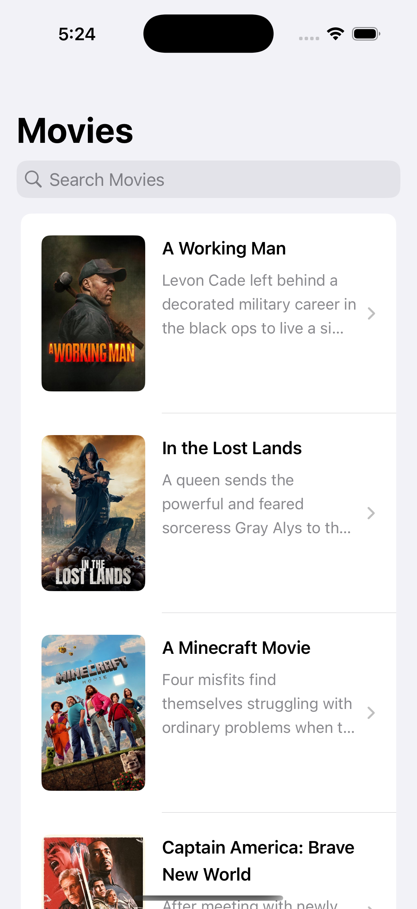

# MyMovie
 1. Open xcode run application above iOS 16_ simulator or device.
 2. In constant fine replace your api key. 
 3. you can genrate your api through api config through setting after login.
 
 
## Screenshot

Here is a screenshot of the application:

